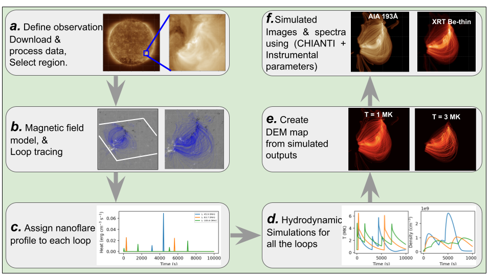

# SunX
[](https://doi.org/10.5281/zenodo.14456559)

SunX is a simulation pipeline designed to model the solar corona, comprising multiple loops, by utilizing observed photospheric magnetograms and hydrodynamic loop models such as EBTEL.




## Install

To install the package and dependencies,
```shell
$ git clone https://github.com/biswajitmb/SunX.git
$ cd SunX
$ pip install .
```

## References

[Mondal et. al., ApJ, 980:75 2025](https://doi.org/10.3847/1538-4357/ada3d6)

[Mondal et. al., ApJ, 967:23 2024](https://doi.org/10.3847/1538-4357/ad2766)

[Mondal et. al., ApJ, 945:37 2023](https://doi.org/10.3847/1538-4357/acb8bb)
